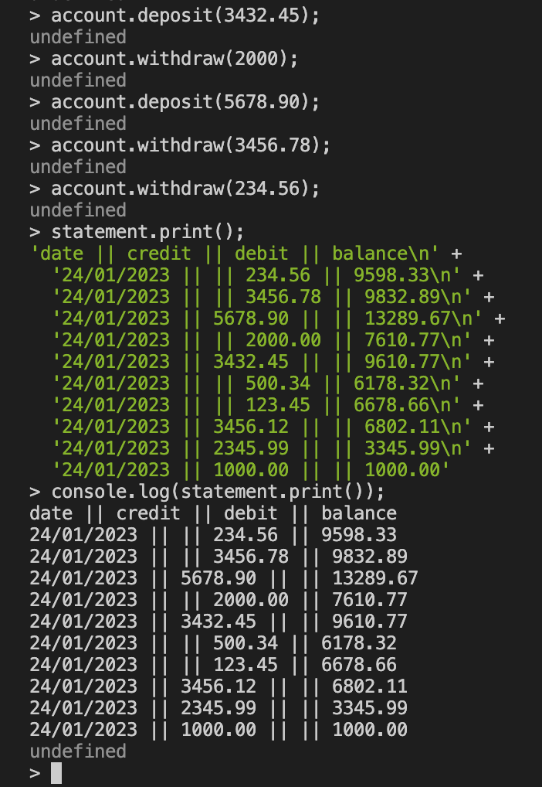
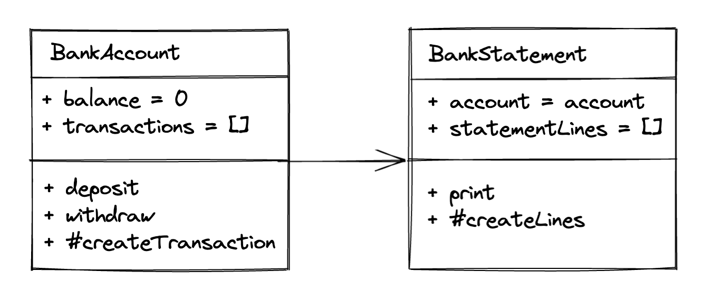

# Bank Tech Test

## Specification

### Requirements

- You should be able to interact with your code via a REPL like IRB or Node. (You don't need to implement a command line interface that takes input from STDIN.)
- Deposits, withdrawal.
- Account statement (date, amount, balance) printing.
- Data can be kept in memory (it doesn't need to be stored to a database or anything).

### Acceptance criteria

**Given** a client makes a deposit of 1000 on 10-01-2023  
**And** a deposit of 2000 on 13-01-2023  
**And** a withdrawal of 500 on 14-01-2023  
**When** she prints her bank statement  
**Then** she would see

```
date || credit || debit || balance
14/01/2023 || || 500.00 || 2500.00
13/01/2023 || 2000.00 || || 3000.00
10/01/2023 || 1000.00 || || 1000.00
```

# Introduction

This is a small banking program I wrote to meet the specification above.

Program running in node REPL



# Setup

1. Node is required in order to run this program
2. Clone or download this repository
3. In the project root folder, install the Node.js dependencies

```bash
cd bank-tech-test
npm install
```

# Usage

To run a sample demonstration of the program, run the demo.js file in the project root folder. You should see a bank statement output printed to the console.

```bash
cd bank-tech-test
node demo.js
```

To use the node REPL to interact with the program, first run `node` in the project root folder then run the following to import the BankAccount and BankStatement classes and create instances of them:

```javascript
const BankAccount = require('./src/bankAccount');
const BankStatement = require('./src/bankStatement');

const account = new BankAccount();
const statement = new BankStatement(account);
```

Now you can interact with the program like in this following example:

```javascript
account.deposit(1000);
account.deposit(2000);
account.withdraw(500);
statement.print();
```

# Tests

To run the tests, in the project directory run:

```bash
jest
```

To see the test coverage, run:

```bash
jest --coverage
```

# Approach

I decided to use two classes as I felt that three seemed unnecesssary.

The BankAccount class is responsible for holding state i.e. storing all transactions and the balance, as well as manipulating its own data.

The BankStatement class acts like a viewer of data. It consumes the BankAccount class and gets the data from it to be formatted into a statement for a user to view.



I used a Test-driven developement approach for the creation of this program, starting with a test and then implementing a feature, gradually building up the program with each subsequent test.
I have unit tests to test each class in isolation as well as integration tests for the interaction of both classes together. Test coverage is 100%.
